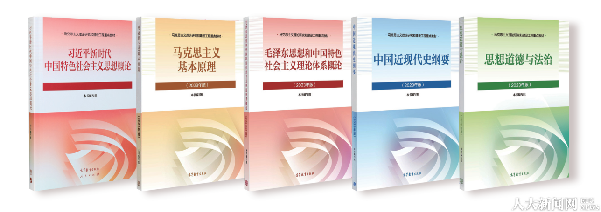

# 思政论文.skill



面向高校思想政治理论课论文写作训练的本地 AI 助手技能包。项目当前以包含 `SKILL.md` 与 `references/` 的通用技能包形式组织，并兼容 Codex 的 skill 目录结构；其中的说明、素材和工作流也可按需要迁移到 Claude Code 等支持本地项目指令或技能目录的工具中。

面向[“十五五”时期一体推进教育、科技、人才发展](https://www.gov.cn/zhengce/202511/content_7046896.htm)、全面实施“人工智能+”行动的战略部署，高校写作训练也应把 AI 素养纳入真实学习任务，培养懂 AI、会用 AI、守规范、能表达的复合型人才。这一定位与教育部等五部门《[“人工智能+教育”行动计划](https://hudong.moe.gov.cn/srcsite/A16/s3342/202604/t20260410_1433240.html)》关于统筹推进人工智能人才培养和应用创新的要求相衔接。

本项目服务于《思想道德与法治》《毛泽东思想和中国特色社会主义理论体系概论》《习近平新时代中国特色社会主义思想概论》《中国近现代史纲要》《马克思主义基本原理》等思政课论文的学习与写作过程，帮助使用者在明确课程要求的基础上进行选题推敲、立论整理、结构检查、资料更新、局部段落补强、语言润色和灵感启发。

## 开发背景与使用边界

开发这个技能包的直接启发，来自我的马克思主义基本原理课程老师关于“马克思主义课程应该拥抱 AI”的论述。它尝试把 AI 放回课程学习、资料整理和改稿训练中使用，帮助使用者发现问题、理清结构、校正文风，同时保留学生本人对观点、材料和最终文本的判断责任。

可以用于：选题比较、问题意识梳理、提纲检查、资料更新、局部段落补强、语言润色和事实核验。

不应用于：整篇代写、生成后直接提交、虚构课堂或实践经历、绕开课程要求。高校课程论文的核心仍然是学生本人对课堂内容、教材概念、现实材料和个人观点的理解与表达。

## 项目定位

本项目强调四点：

1. 学生负责：论文的主题判断、中心论点、材料取舍和最终表达应由学生本人负责，AI 只提供辅助。
2. 方向正确：坚持马克思主义立场观点方法，围绕中国式现代化、文化自信、生态文明、青年担当、法治建设、基层治理等主题展开论证。
3. 论证扎实：先有问题意识、课程概念和事实材料，再使用修辞与表达素材。
4. 表达自然：减少空泛套话和机械堆砌，让论文既符合课程规范，又有清楚的思考脉络。

## 目录结构

```text
思政论文.skill/
├── README.md
└── red-course-paper/
    ├── SKILL.md
    ├── 课本.png
    ├── agents/
    │   └── openai.yaml
    └── references/
        ├── anti-ai-checklist.md
        ├── argument-patterns.md
        ├── course-map.md
        ├── negative-prompts.md
        ├── style-and-diction.md
        └── material-library/
            ├── current-source-refresh-protocol.md
            ├── mainstream-commentary-source-index.md
            ├── mainstream-commentary-writing-patterns.md
            ├── theme-expression-source-index.md
            └── theme-taxonomy-and-refresh.md
```

## 主要能力

### 1. 课程类型判断

`references/course-map.md` 按课程区分写作重点：

- 思想道德与法治：个人成长、法治意识、公共生活、青年责任。
- 中国特色社会主义：制度逻辑、中国式现代化、高质量发展、治理能力。
- 中国近现代史纲要：历史选择、道路比较、民族复兴、历史经验。
- 马克思主义基本原理：概念辨析、矛盾分析、历史唯物主义、政治经济学。

### 2. 论文结构搭建

`references/argument-patterns.md` 提供常见论证骨架：

- 概念澄清式
- 历史选择式
- 当代治理逻辑式
- 青年成长担当式
- 现象批判式
- 辩证分析式
- 结尾收束式

### 3. 表达与去 AI 味

`references/style-and-diction.md` 收录传统文化、科技创新、家国情怀、青年担当、生态文明等主题表达素材，并设置慎用规则，避免辞藻堆砌。

`references/anti-ai-checklist.md` 用于检查：

- 是否有空泛升华
- 是否有机械三段式
- 是否只表态不分析
- 是否缺少具体例证
- 是否把政策名称当作论证

`references/negative-prompts.md` 用于提前规避不适合思政论文的写法，例如高频“不是……而是……”句式、空泛管理词汇、突兀比喻、聊天式总结口头禅、模糊归因和机械三段式。

### 4. 主流评论素材库

`references/material-library/mainstream-commentary-source-index.md` 收录人民网、求是网、光明网、中国青年报、半月谈等公开评论资源的来源卡片。

`references/material-library/mainstream-commentary-writing-patterns.md` 提炼这些文章的写法，例如：

- 具体场景到理论
- 历史道路选择
- 辩证关系分析
- 问题到治理路径

### 5. 主题素材与时效更新

`references/material-library/theme-taxonomy-and-refresh.md` 将作文素材主题转化为思政论文可用主题，并建立时效性替换规则。

目前重点维护的主题包括：

- 家国情怀 / 国家认同
- 时代青年 / 责任担当
- 文化自信 / 传统文化传承
- 科技创新 / 新质生产力
- 生态文明 / 绿色发展
- 规则与自由 / 法治意识
- 开放共赢 / 人类命运共同体
- 基层治理 / 形式主义 / 制度建设

`references/material-library/current-source-refresh-protocol.md` 要求在使用法律、规划、政府工作报告、年度政策、AI、教育、生态等时效性材料时，优先核验官方来源。

## 使用方式

### 在本项目中调用

将 `red-course-paper` 安装或复制到对应工具的技能目录、项目指令目录或本地工作区后，可以用类似方式辅助写作训练：

```text
请使用 red-course-paper 帮我比较“青年担当与中国式现代化”“法治意识与公共生活”这两个选题，指出哪个更适合我的思修课程论文，并给出提纲建议和需要我自己补充的材料方向。
```

也可以用于检查提纲、补强局部段落或改稿：

```text
请使用 red-course-paper 检查我已经写好的马原论文草稿，重点指出概念分析不足、论证跳跃和语言空泛的地方，并给出修改建议。
```

```text
请使用 red-course-paper 在我已有正文的第二部分后，建议一个可以继续展开的过渡段思路，不要直接替我完成整段。
```

### 推荐输入信息

为了获得更好的结果，建议提供：

- 课程名称
- 论文题目或主题
- 字数要求
- 老师要求或评分标准
- 是否需要参考文献
- 已有草稿或提纲
- 是否偏重选题、提纲检查、局部补强、改稿、润色或资料更新

## 写作原则

使用本技能包时，应优先完成以下步骤：

1. 明确课程与题目。
2. 由学生本人形成中心论点。
3. 使用本技能包检查论证结构是否合理。
4. 查验必要的官方资料，并由学生判断材料是否适合自己的论文。
5. 在学生已有提纲或草稿基础上进行局部补强和修改。
6. 使用表达素材适度润色，避免替代个人表达。
7. 使用负面提示词清单删除公式化表达。
8. 进行去 AI 味和事实核验检查。
9. 由学生本人完成最终审阅、取舍和提交前确认。

## 更新规则

本项目中的时效性材料需要持续更新。遇到以下内容时，应重新核验：

- 新的五年规划、政府工作报告和重要会议文件
- 新出台或新修订的法律法规
- 教育、科技、生态、人工智能、青年发展等领域的新政策
- 课程教材版本变化
- 用户明确要求使用最新材料

已经过时的素材不应作为当前论据直接使用。例如，抗疫主题可作为历史记忆、公共卫生治理或社会韧性材料，但不作为默认的当下热点；旧阶段表述也应根据最新官方文件调整。

## 注意事项

本项目用于辅助学习、写作训练、草稿修改和表达优化。使用时应尊重课程要求，结合个人学习体会、课堂内容和真实材料完成论文。涉及政策、法律、规划和重要会议精神时，应以官方最新公开文本为准。

本项目不鼓励、不支持、也不应被用于整篇论文代写。若课程、学院或学校对 AI 使用有明确规定，应优先遵守相关规定；若需要说明 AI 使用情况，应按照课程要求如实说明。使用者需要对观点、材料、修改和最终提交文本负责。

本项目将持续更新，包括课程写作场景、表达素材、负面提示词、时效性材料和不同工具环境下的使用方式。欢迎大家在使用过程中向我提出建议，帮助这个技能包更贴近真实课堂、真实写作和真实修改需求。
